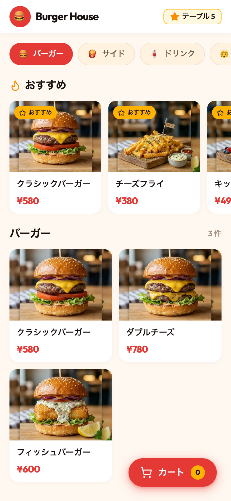
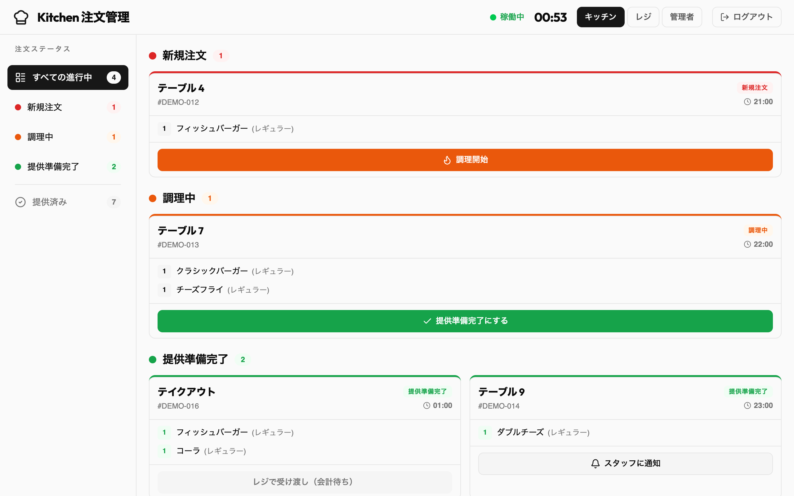
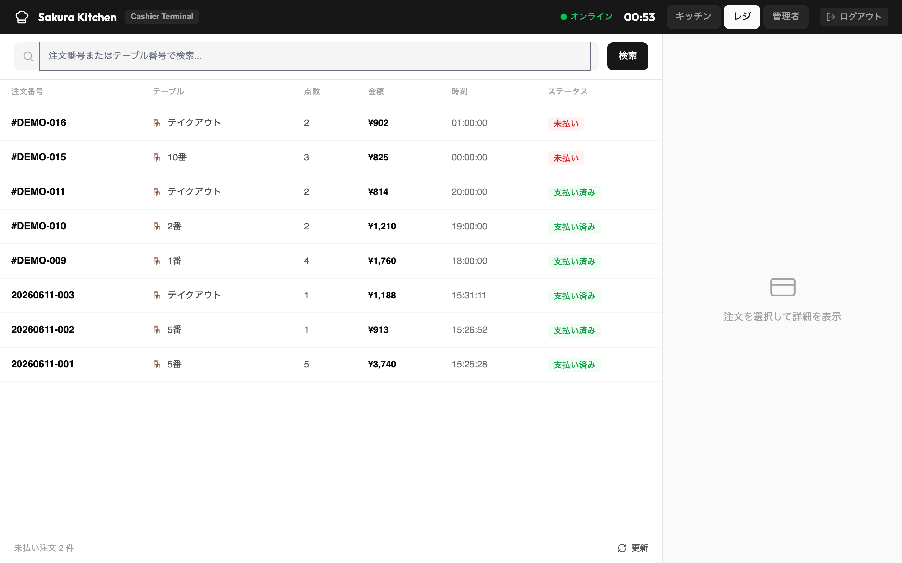
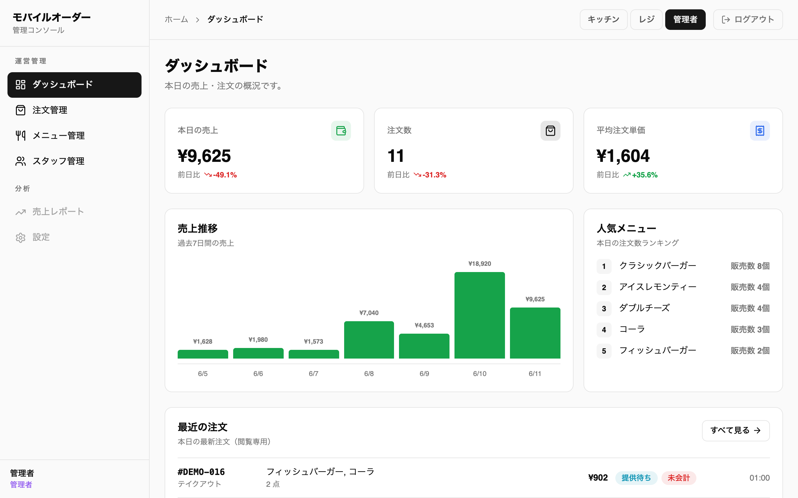
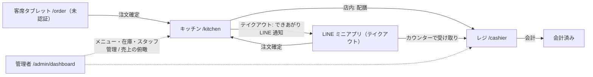
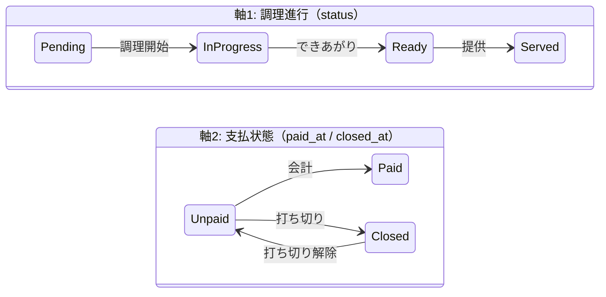

# Table Order — 飲食店向けテーブルオーダーアプリ（POC）

[](https://github.com/e601201/table_order_app/actions/workflows/ci.yml)

客席のタブレットから注文し、キッチンが調理状況を進め、レジが会計する——3つの役割がひとつの注文（`Order`）を囲んで動く、飲食店向けモバイルオーダーの POC です。LINE ミニアプリ経由のテイクアウト注文（LINE ログイン・できあがり通知）にも対応しています。

## 画面イメージ

<table>
  <tr>
    <td align="center" width="32%">
      <b>客席</b>（<code>/order</code>・モバイル）<br>
      
    </td>
    <td align="center">
      <b>キッチン</b>（<code>/kitchen</code>）<br>
      <br><br>
      <b>レジ</b>（<code>/cashier</code>）<br>
      
    </td>
  </tr>
  <tr>
    <td align="center" colspan="2">
      <b>管理コンソール</b>（<code>/admin</code>）<br>
      
    </td>
  </tr>
</table>

## 全体像

| 画面 | URL | 利用者 | 認証 |
|---|---|---|---|
| 客席（メニュー・カート・注文確定） | `/order` | 客 | 不要 |
| 注文状況（店内注文の調理進捗をライブ表示） | `/order/status` | 客 | 不要 |
| テイクアウト注文・注文履歴 | LINE ミニアプリ（LIFF URL） | 客 | LINE ログイン |
| キッチン（調理状況の進行） | `/kitchen` | キッチン / 管理者 | スタッフログイン |
| レジ（会計・打ち切り） | `/cashier` | レジ / 管理者 | スタッフログイン |
| 管理コンソール（統計・メニュー・在庫・スタッフ・注文の俯瞰） | `/admin/dashboard` | 管理者 | スタッフログイン |



## 注文のライフサイクル（二軸状態）

`Order` は「調理進行」と「支払状態」の独立した2軸で状態を持ちます（ADR-0001）。



- **店内注文**は配膳後に会計します。「提供済みかつ未会計（`Served + Unpaid`）」がそのままレジの作業キューです。店内の客は**注文状況**（`/order/status`）で自分の注文の調理進捗をライブで確認できます。この画面は調理軸だけを描き、会計軸（会計済み・打ち切り・理由コード）は表示しません。提供前に打ち切られた注文だけは中立文言「ご用意できませんでした」で表されます（ADR-0012）。
- **テイクアウト注文**は `Ready` になると LINE 通知で客を呼び出し、カウンターでの受け渡しと会計が同一の操作になるため、レジの会計で `Served + Paid` に同時に進みます（ADR-0009）。
- **打ち切り**は、レジが未会計の注文を支払いなしで閉じる操作です（理由コード必須: `no_show` / `out_of_stock` / `customer_request` / `walkout` — ADR-0010）。調理軸には触れず注文を止まっていた場所で凍結するので、**打ち切り解除**すれば元の作業キューにそのまま戻ります。`Paid` と `Closed` は排他です（返金はありません）。
- **会計は来店を終えます**（ADR-0013）。店内でそのタブレット（セッション）から出された全注文が支払軸の終端に達し、かつ1件でも会計済みになると、カートと注文状況が自動でクリアされ、次の客に前の客の注文が残りません。打ち切りだけでは来店は終わらず、その場合はウェルカム画面からの再入店が来店の切り替わりになります。

用語の正確な定義（ユビキタス言語）は [CONTEXT.md](CONTEXT.md) を、設計判断の経緯は [docs/adr/](docs/adr/) を参照してください。

## 商品在庫・売り切れ

メニューは商品ごとに在庫数（未設定なら無制限）と販売停止フラグを持ちます（ADR-0011）。

- 客には売り切れ・販売停止とも単一の「売り切れ」バッジで表示し、残数は見せません。売り切れ商品はカートに追加できませんが、メニューからは消えません。
- 在庫の引き当ては注文確定時のみで、カートは在庫を予約しません。確定時に在庫が足りなければ注文全体をロールバックしてカートへ差し戻し、客自身が数量を調整して再確定します（売り越しは起きません）。
- 補充・販売停止の切り替えは管理コンソールのメニュー一覧からワンタップで行えます。自動の日次リセットはなく、営業前に補充する運用です。

## 技術スタック

| 区分 | 技術 |
|---|---|
| バックエンド | Rails 8.1 / Ruby 4.0 / PostgreSQL |
| フロントエンド | React 19 + TypeScript + Inertia.js（サーバー駆動 SPA・REST API なし） |
| スタイリング | Tailwind CSS 4（Vite プラグイン）・lucide-react |
| ビルド | Vite 8 + vite-plugin-ruby |
| テスト | Minitest（Rails）・Vitest（フロントの純粋ロジックの単体テスト） |
| 認証 | `has_secure_password`（スタッフ）・LIFF ID トークン検証（テイクアウト客） |
| 画像 | Active Storage（メニュー画像） |
| 外部連携 | LINE ミニアプリ（LIFF）・LINE サービスメッセージ API |
| デプロイ | Kamal + Docker |

## セットアップ

前提: Ruby 4.0.4（`.ruby-version`）・Node.js 20 以上・PostgreSQL

```bash
git clone git@github.com:e601201/table_order_app.git
cd table_order_app
bin/setup   # 依存インストール → DB 準備（シード込み）→ 開発サーバー起動まで一括
```

起動後 http://localhost:3000 を開きます。サーバーを起動せず準備だけ行う場合は `bin/setup --skip-server` を使ってください。

シードでメニュー8品（画像付き）と、開発環境のみ各状態のデモ注文が投入されるので、すぐに全画面を試せます。デモ注文を作り直すには `bin/rails db:seed` を再実行します（冪等）。

### デモアカウント

スタッフ画面（`/login`）には以下でログインできます。

| ログイン ID | パスワード | ロール |
|---|---|---|
| `admin` | `password` | 管理者（全スタッフ画面に入れます） |

開発シードの値です。本番では初回シード時に環境変数 `INITIAL_ADMIN_PASSWORD` でパスワードを指定します。キッチン・レジ用のスタッフアカウントは管理コンソールから作成できます。

### LINE ミニアプリ連携（任意）

テイクアウト機能を動かす場合のみ必要です。**未設定でも店内フロー（客席・キッチン・レジ・管理コンソール）はすべて動きます。**

`.env` に以下の4つを設定します（LINE Developers コンソールの値）。

```
LINE_CHANNEL_ID=...
LINE_CHANNEL_SECRET=...
LINE_LIFF_ID=...
LINE_READY_TEMPLATE_NAME=...   # できあがり通知のサービスメッセージテンプレート名
```

実機での検証は ngrok 経由で行います（開発環境で許可済み）。設計の経緯は [ADR-0008](docs/adr/0008-line-mini-app-takeout-identity.md) / [ADR-0009](docs/adr/0009-takeout-handover-at-settlement.md) を参照してください。

## 開発コマンド

```bash
bin/dev                  # 開発サーバー一括起動（Rails + Vite + Tailwind ウォッチャー）
bin/rails test           # Rails テスト実行（Minitest）
bin/rubocop              # Ruby リンター
bin/brakeman             # セキュリティスキャン
npm run check            # TypeScript 型チェック
npm test                 # フロントのユニットテスト（Vitest）
```

CI（GitHub Actions）が PR と main への push ごとに静的解析（brakeman / bundler-audit）・リント（rubocop）・テスト（Rails の Minitest とフロントの Vitest）を実行します。

## デプロイ

Kamal + Docker で単一サーバーにデプロイします。main へのマージで CI の全チェックが通ると、GitHub Actions の deploy ジョブが `kamal deploy` で本番へ自動デプロイします（Actions タブからの手動実行も可能。GitHub Secrets に `RAILS_MASTER_KEY` と `SSH_PRIVATE_KEY` が必要）。設定は `config/deploy.yml`、シークレットは `.kamal/secrets`（Rails credentials から注入）にあります。

## ドキュメント

| ドキュメント | 内容 |
|---|---|
| [CONTEXT.md](CONTEXT.md) | ドメイン用語集（ユビキタス言語）・役割と状態の正確な定義 |
| [docs/adr/](docs/adr/) | アーキテクチャ上の意思決定の記録（ADR-0001〜0013） |
| [CLAUDE.md](CLAUDE.md) | AI エージェント向けの開発ガイド（ディレクトリ構成・ルーティング詳細） |
| [docs/agents/](docs/agents/) | エージェント運用ルール（イシュートラッカー・トリアージラベル） |
